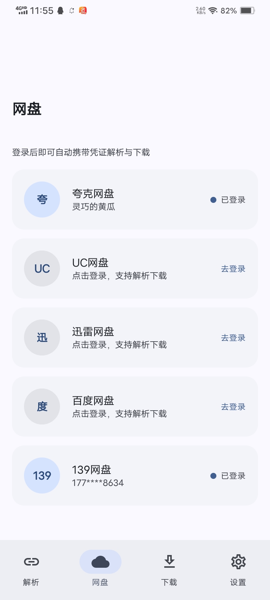
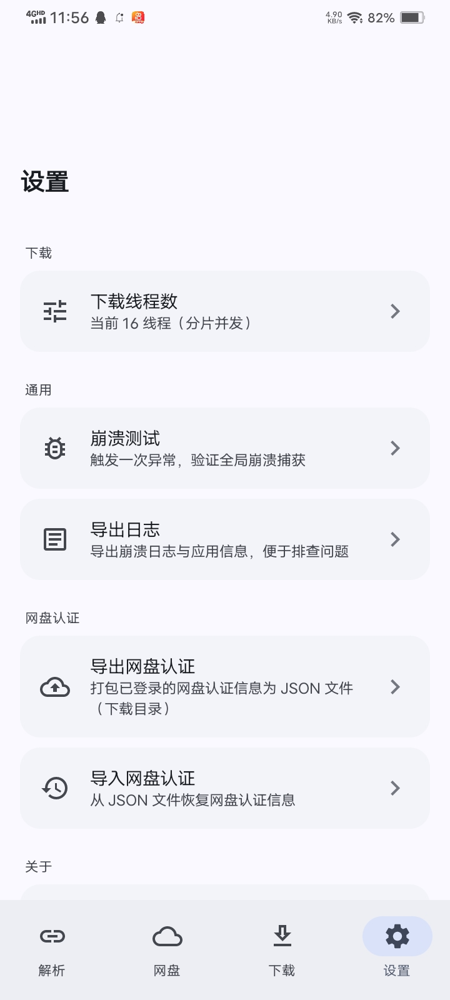
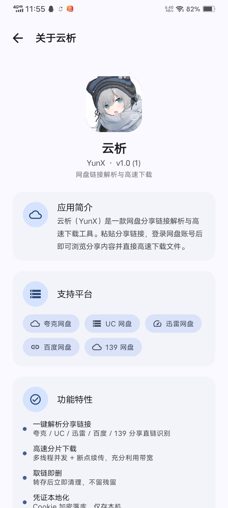

# YunX（云析）

网盘分享链接解析与高速下载的 Android 应用。粘贴分享链接，就能浏览分享内容并直接下载文件。

## 支持平台

**不建议用百度网盘，可能导致账号被风控！！！**
- 夸克网盘
- UC 网盘
- 迅雷网盘
- 百度网盘
- 139 网盘（和彩云）
- ~~其他网盘懒得写了，如有需要请打开一个issue~~

## 功能

- **分享链接解析**：识别夸克 / UC / 迅雷 / 百度 / 139 的分享链接，自动匹配提取码
- **高速下载**：分片多线程并发 + 断点续传，线程数可在设置页调整
- **取链即删**：百度、夸克转存后立即删除临时文件，网盘不留残留
- **WebView 登录**：直接在应用内打开网盘登录页，登录后自动提取 Cookie，不用自己实现登录协议
- **认证备份**：把已登录的网盘认证信息导出为 JSON 文件，换设备可直接导入恢复
- **剪贴板识别**：复制分享链接后回到应用，提示一键粘贴解析

## 截图

| 解析直链 | 分享解析 | 下载管理 |
|:---:|:---:|:---:|
|  |  |  |

| 网盘登录 | 设置 | 关于 |
|:---:|:---:|:---:|
|  |  |  |

## 使用

1. 在「网盘」页登录需要用的网盘账号
2. 在「解析」页粘贴分享链接（可带提取码）
3. 浏览分享内容，点击文件获取下载直链
4. 「下载」页查看进度，支持暂停 / 继续 / 删除 / 打开

## 技术栈

- Kotlin
- Jetpack Compose + Material 3
- Room（凭证与下载任务持久化）
- OkHttp（网络请求 + 分片下载）
- KSP

## 构建

要求：minSdk 21，targetSdk 34。

```
git clone https://github.com/CYQawa/YunX.git
```

用 Android Studio 打开项目直接构建即可。项目在 AndroidIDE 上开发调试，理论上也兼容其它 Android 构建环境。

## 免责声明

本项目仅供个人学习与技术交流，请勿用于商业用途。下载内容版权归原作者所有，请在下载后 24 小时内删除。使用本项目产生的任何后果由使用者自行承担。

## 开源协议

本项目基于 [GNU AGPL-3.0](https://www.gnu.org/licenses/agpl-3.0.html) 协议开源，详见根目录 [LICENSE](./LICENSE)。

## 关于协议逆向

部分网盘平台的解析基于抓包分析与开源项目（如 alist）的协议研究整理，接口可能随官方调整而失效，请以实际运行结果为准。
